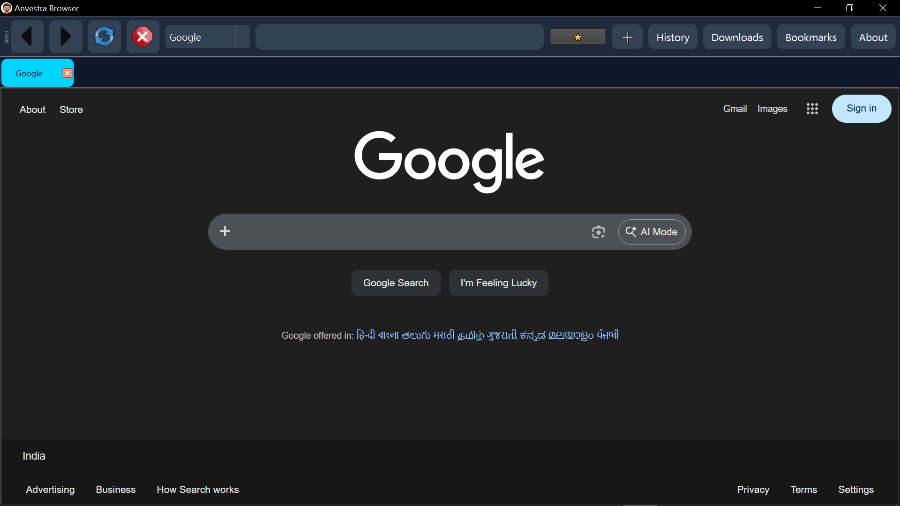
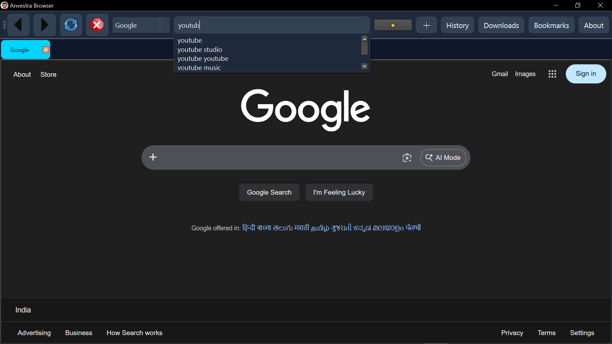
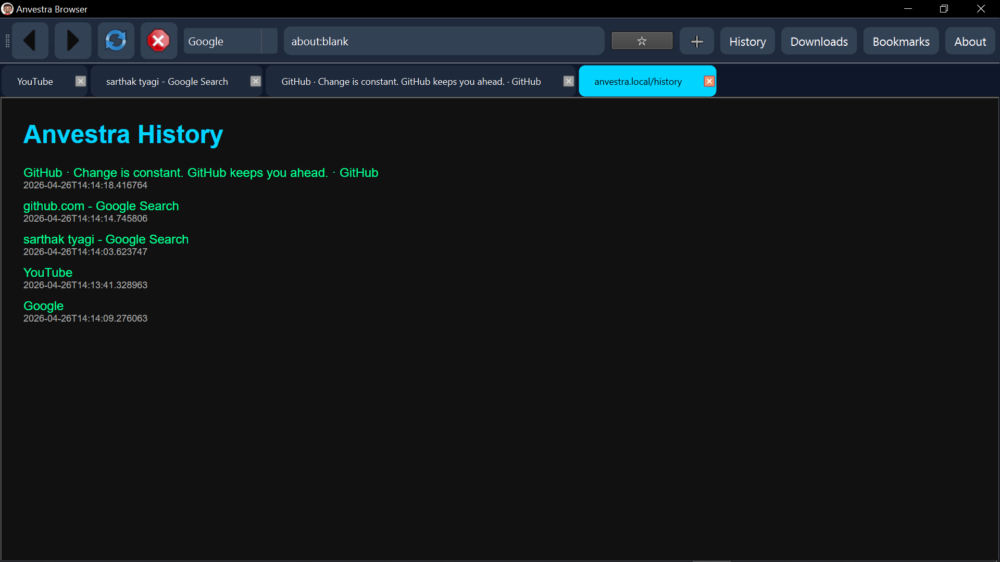
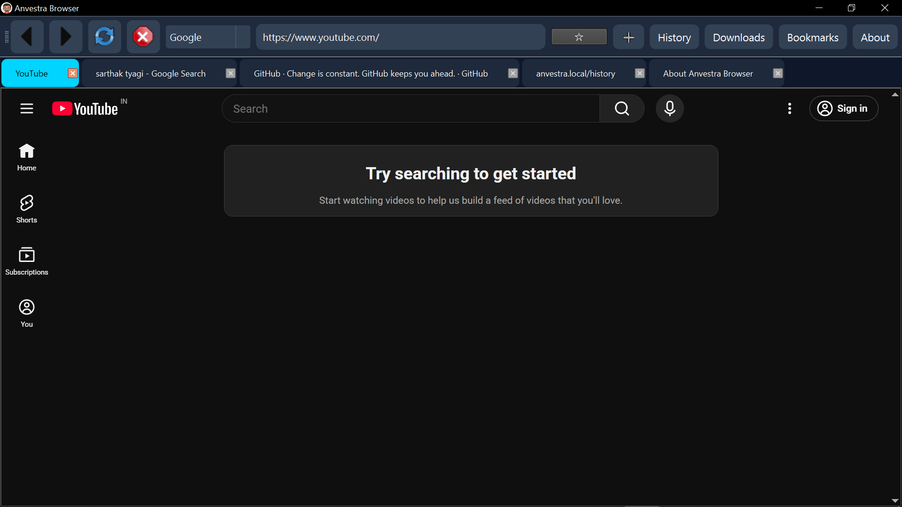
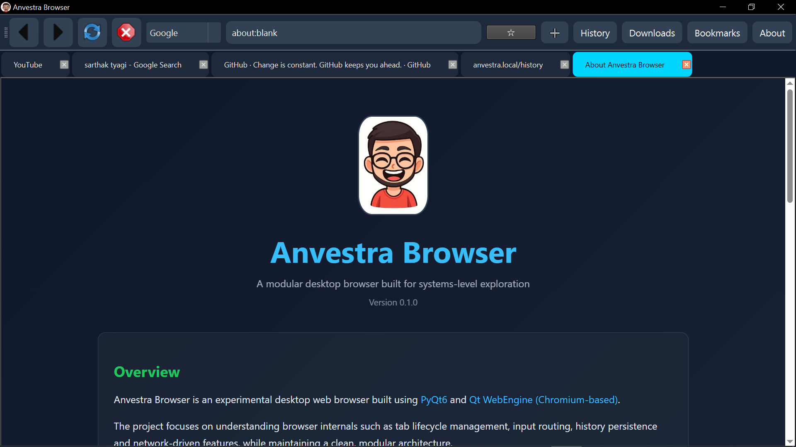

# Anvestra - Desktop Web Browser (PyQt6)

A lightweight, multi-tab desktop web browser built using PyQt6 and Qt WebEngine.
Anvestra focuses on core browser functionality while integrating persistent data handling, search flexibility and real-time user interaction features.

---

## Demo

[](Images/Anvestravid.mp4)

---

## Screenshots










---

## Features

* **Multi-Tab Browsing**
  Seamless tab management with independent navigation per tab.

* **Search Engine Switching**
  Dynamically switch between Google, Bing and DuckDuckGo per tab.

* **Smart URL Handling**
  Automatically distinguishes between URLs and search queries.

* **Real-Time Autocomplete**
  Combines Google Suggest API with locally stored browsing history using debounced requests.

* **Persistent History (SQLite)**
  Stores visited pages with timestamps and supports fast lookup.

* **Bookmark Management**
  Add, remove and access bookmarks with persistent storage.

* **Internal Browser Pages**
  Dedicated pages for History, Bookmarks, Downloads and About.

* **Keyboard Shortcuts**
  Common browser shortcuts (Ctrl+T, Ctrl+W, Ctrl+L, CTRL+R, etc.) for efficient navigation.

---

## Tech Stack

* **Python**
* **PyQt6**
* **Qt WebEngine (Chromium-based rendering engine)**
* **SQLite (for persistence)**
* **QNetworkAccessManager (for async network requests)**

---

## Architecture Overview

**Anvestra** is structured as a modular desktop application:

* **Main Browser** - Main UI and user interaction layer
* **TabManager** - Handles tab lifecycle and navigation
* **HistoryManager** - Manages SQLite-based history and bookmarks
* **BrowserWindow** - Handles browser-specific behaviors
* **Utils Module** - URL parsing and search routing

This separation ensures clear boundaries between UI, networking and data persistence.

---

## How to Run Locally

```bash
pip install -r requirements.txt
python main.py
```

---

## Build Executable (Optional)

* Install ```pyinstaller``` using ```pip install pyinstaller```

* Use the command to convert .py to .exe
```bash
pyinstaller --noconfirm --windowed --name Anvestra main.py
```

---

## Notes

* Built as a systems-level learning project to understand browser architecture and state management.
* Focuses on integrating UI, networking and persistent storage into a cohesive application.
* Not intended as a production browser, but as a functional and extensible prototype.

---

## Author

**Sarthak Tyagi**

* GitHub: https://github.com/sarthak-cs
* LinkedIn: https://www.linkedin.com/in/sarthak-tyagi-cs

---

## License

This project is open-source and available under the MIT License.
